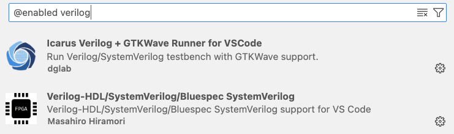
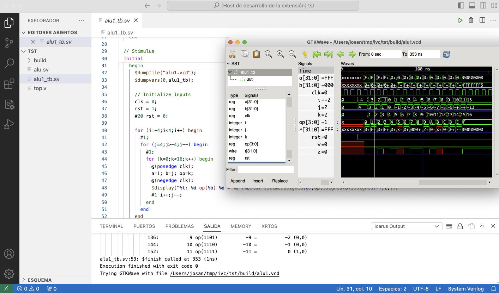

# Icarus Verilog + GTKWave Runner for VSCode

Run Verilog/SystemVerilog testbench with Icarus Verilog and GTKWave support.

## Requirements

The extension need Verilog and SystemVerilog filetypes registry in VSCode, the easy way is to install previously the extension `mshr-h.veriloghdl` from [VS Code Marketplace](https://marketplace.visualstudio.com/items/mshr-h.VerilogHDL) or [Open VSX Registry](https://open-vsx.org/extension/mshr-h/veriloghdl) that includes HDL support for VS Code with Syntax Highlighting, Snippets, Linting, Formatting, etc.

Also it is necessary to install Icarus Verilog and GTKWave tools, and be sure that `iverilog` and `gtkwave` have beebn added to your environment PATH variable.
If you need help, check out the installation guide for [Windows](http://bleyer.org/icarus/) and [other OSes](https://iverilog.fandom.com/wiki/Installation_Guide).

## Usage

The extension adds in VSCode:

- two buttons in the titlebar of any **Verilog/SystemVerilog** file:
  - Run testbench simulation
  - Stop simulation and clean build files
- a **status** item positioned in the lower-right corner
- **console log output** of commands and running testbench

## Configuration settings

- `verilog.gtkwaveWatchGlob`: GTKWave will be launched when a file relative to the build directory satisfy this glob ([VCD files](https://gtkwave.sourceforge.net/gtkwave.pdf)).
- `verilog.icarusCompileArguments`: Arguments passed to Verilog compiler (see [Icarus Verilog documentation](https://steveicarus.github.io/iverilog/)).
- `verilog.icarusBuildDirectory`: Build folder path relative to workspace root (recommended).
- `verilog.icarusPersistentBuild`: True if build folder should not be cleared before each compilation.

## License

The extension code is licensed under MIT.

## Thanks

This extension began as a fork of Verilog Testbench Runner `theonekevin.icarusext` in order to include support for SystemVerilog files and automate GTKWave launch. 
Acknowledgments to Kevin Dai.
